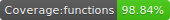

# Data Structures Algorithms and Code Challenges





## Installation

You will need to install [node.js](https://nodejs.org/en/) in order to run **jest** tests

## Run Tests

1. Clone this repo
2. In your terminal, `cd` into the repo directory
3. Available scripts to run. Can be with `npm` or `yarn`.

```bash
~ yarn test
~ yarn test:watch
~ yarn test:badges
~ yarn test:coverage
```